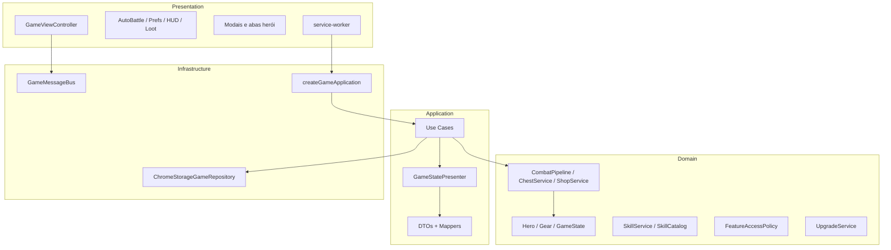

# 035 — Auditoria SOLID / Clean Architecture (pós-refatoração)

## Status: análise concluída — commit `294d762`

## Nota geral: **8,5 / 10** (era ~7/10 antes do Bloco A/B/C)

---

## Regra de dependência — verificação automática

| Camada | Pode importar | Estado |
|--------|---------------|--------|
| `domain/` | só domain | ✅ Nenhum import de application/infrastructure/presentation |
| `application/` | domain | ✅ Correto (use cases orquestram domínio) |
| `infrastructure/` | domain + application | ✅ Repositório, DI, messaging |
| `presentation/` | application + infrastructure* | ✅ **Zero imports de `domain/`** |

\* Presentation importa `infrastructure/messaging` para `sendGameMessage` — aceitável em extensão Chrome; em CA estrita, seria uma porta na application.

---

## O que está profissional ✅

### Clean Architecture
- **Use cases finos** por ação (`TickGameUseCase`, `SpendImprovementPointUseCase`, etc.)
- **`GameStatePresenter`** centraliza domínio → DTO
- **DTOs próprios** (`FeatureFlagsDto`, `AttributesDto`) — UI não conhece entidades
- **`FeatureAccessPolicy`** — política única; UI lê `state.featureFlags`
- **Repositório abstrato** (`IGameStateRepository`)
- **Composition root** (`createGameApplication` + `GameApplication`)
- **Domínio puro** — entidades imutáveis, value objects, catálogos declarativos

### SOLID — melhorias concretas
| Princípio | Antes | Agora |
|-----------|-------|-------|
| **S** | God `GameViewController`, `CombatService` monolítico | Pipeline de combate, controllers extraídos, `ChestService` |
| **O** | — | Catálogos `SkillCatalog`, `UpgradeCatalog` extensíveis |
| **L** | — | Imutabilidade consistente |
| **I** | Só `IGameStateRepository` | + `ICombatService`, `ILootService` |
| **D** | Serviços concretos everywhere | Tick usa `ICombatService`; loot via `ILootService` |

### Testes
- 3 suites vitest no domínio (`FeatureAccessPolicy`, `GearRequirementChecker`, `ProgressionRequirementEvaluator`)

---

## Débitos restantes (prioridade para Fase 3+)

### Alta
| Item | Risco | Sugestão |
|------|-------|----------|
| `GameViewController` ~892 linhas | SRP — modais, shop, upgrades, hero progression no mesmo arquivo | Extrair `ModalFlowController` + `ShopFlowController` |
| `Hero.ts` ~307 linhas | Entidade inchada (stats, equip, XP, progressão, skills) | `HeroProgression` value object ou `HeroProgressionService` |
| Skills **não** no combate | `CombatPipeline` só ataque físico | Fase 3: `CombatSkillResolver` entre fases |
| 3 testes apenas | Regressão em refactors futuros | Testes para `SkillService`, `ChestService`, `CombatPipeline` |

### Média
| Item | Notas |
|------|-------|
| `RequirementEvaluator` + `ProgressionRequirementEvaluator` duplicados | Unificar em `domain/requirements/` genérico |
| `SkillNodeView` / `UpgradeNodeView` no domínio | Mappers da application dependem desses tipos — ok, mas ideal: interfaces de leitura na application |
| `GameStatePresenter` → `UpgradeService` | Extrair `purchasableUpgradeCount` para query dedicada |
| `GameApplication` instancia tudo | Mover wiring completo para `infrastructure/di/` |
| `service-worker.ts` em `presentation/` | Mover para `infrastructure/entry/` |

### Baixa
| Item | Notas |
|------|-------|
| `BuyShopOfferUseCase` cria `Gear` com novo id | Poderia ser `ShopService.purchase()` |
| Sem interfaces para `SkillService`, `ChestService` | Adicionar quando houver mocks em testes de use case |
| `presentation` → `infrastructure` direto | Criar `GameClientPort` na application se quiser CA 100% estrita |

---

## Mapa de camadas atual

---

## Conclusão

O projeto **está em nível profissional** para seguir com Fase 3 (skills no combate). A espinha dorsal CA está correta; os débitos são **refinamentos**, não blockers estruturais.

**Pode continuar** com a implementação de combate/skills/ascensão sobre esta base.
