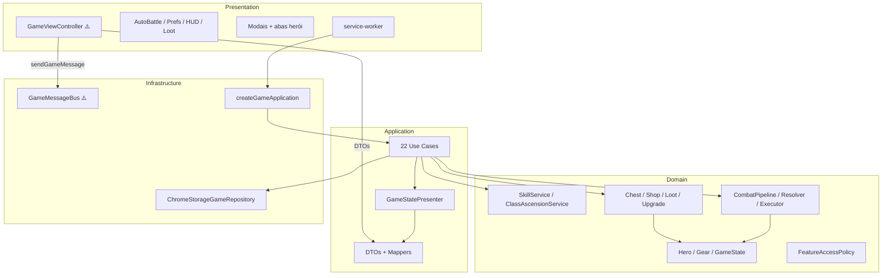

# 038 — Auditoria SOLID / Clean Architecture (pós Fase 3 + Fase 4)

## Status: análise concluída — commits `46a8b05` (Fase 3) + `9158ebc` (Fase 4)

## Nota geral: **8,7 / 10** (era 8,5 após Bloco A/B/C)

| Dimensão | Nota | Comentário |
|----------|------|------------|
| Regra de dependência (camadas) | 9/10 | Domain puro; application limpa; presentation→infra é o principal gap |
| SOLID no domain | 8,5/10 | Combate e progressão bem separados; `Hero` ainda inchado |
| Use cases / application | 9/10 | 22 use cases coesos, presenter centralizado |
| Testabilidade | 6,5/10 | 18 testes no domain; application/infra sem cobertura |
| Escalabilidade futura | 9/10 | Catálogos declarativos; novas skills/ascensões sem reescrever pipeline |

**Veredito:** base **profissional e segura para evoluir**. Débitos são refinamentos, não blockers estruturais.

---

## Regra de dependência — verificação

| Camada | Pode importar | Estado atual |
|--------|---------------|--------------|
| `domain/` | só domain | ✅ Zero imports de outras camadas |
| `application/` | domain | ✅ Zero imports de infra/presentation |
| `infrastructure/` | domain + application (DTOs em messaging) | ⚠️ `GameMessageBus` importa DTOs |
| `presentation/` | application (DTOs) + infrastructure | ⚠️ Não importa `domain/` ✅, mas acopla infra direto |

### Violações confirmadas

1. **`presentation` → `infrastructure`** (8 arquivos)
   - `GameViewController` → `GameMessageBus`, `ExtensionContext`
   - `service-worker.ts` → DI, storage, messaging
   - Content scripts → `SidebarPreferences`

2. **`infrastructure` → `application/dto`** 
   - `GameMessageBus.ts` tipa respostas com DTOs da application

3. **Dentro do domain (DIP)**
   - `Hero.canEquip()` instancia `GearRequirementChecker` inline

---

## SOLID — avaliação por princípio

### S — Single Responsibility ✅ com ressalvas

| Módulo | Avaliação |
|--------|-----------|
| `CombatPipeline` + fases | ✅ Cada fase uma responsabilidade |
| `CombatSkillResolver` / `CombatActionExecutor` | ✅ Escolha vs aplicação separadas |
| `SkillCombatCatalog` vs `SkillCatalog` | ✅ Progressão ≠ combate |
| `ClassAscensionService` vs `SkillService` | ✅ Ascensão ≠ árvore de skills |
| `GameViewController` (~1090 linhas) | ❌ God object — modais, shop, loot, hero, ascensão, tick |
| `Hero.ts` (~332 linhas) | ⚠️ Stats, XP, equip, skills, ascensão na mesma entidade |

### O — Open/Closed ✅

- Nova skill de combate = entrada em `SkillCombatCatalog` + `SkillCatalog`
- Nova ascensão = `ClassAscensionCatalog` + skills `pointType: 'ascension'`
- Novo upgrade = `UpgradeCatalog`
- Resolver/executor/pipeline **não precisam mudar**

### L — Liskov Substitution ✅

- Entidades imutáveis (`Hero`, `GameState`) — substituição por valor
- `CombatSkillResolver` substituível via `ICombatSkillResolver` (testes)

### I — Interface Segregation ⚠️ parcial

**Interfaces existentes:**
- `IGameStateRepository`
- `ICombatService`, `ILootService`
- `ICombatSkillResolver`

**Sem interface (acoplamento a concreto):**
- `SkillService`, `ClassAscensionService`, `ChestService`, `ShopService`, `UpgradeService`

Aceitável no estágio atual; criar interfaces quando testar use cases com mocks.

### D — Dependency Inversion ⚠️ parcial

**Bom:**
- Use cases dependem de `IGameStateRepository`, `ICombatService`
- `HeroActionPhase` injeta `ICombatSkillResolver`
- Composition root em `createGameApplication` + `GameApplication`

**A melhorar:**
- `GameApplication` instancia 10+ serviços com `new` — wiring deveria estar só em `infrastructure/di/`
- `Hero` → `GearRequirementChecker` (entidade cria serviço)
- UI → `sendGameMessage` direto (sem port na application)

---

## Clean Architecture — o que está profissional ✅

1. **22 use cases** finos — uma ação por classe
2. **`GameStatePresenter`** — único ponto domínio → DTO
3. **DTOs desacoplados** — UI não conhece entidades
4. **`FeatureAccessPolicy`** — política única de features
5. **Domínio puro** — entidades imutáveis, VOs, catálogos declarativos
6. **Combate em pipeline** — Fase 3 entregou arquitetura escalável
7. **Progressão em bounded contexts** — `progression/`, `upgrades/`, `combat/`
8. **Zero `presentation` → `domain`** — conquista do Bloco A mantida

---

## Evolução desde auditoria 035

| Item (035) | Status pós Fase 3+4 |
|------------|---------------------|
| Skills no combate | ✅ `CombatSkillResolver` + `HeroActionPhase` |
| `HeroAttackPhase` monolítico | ✅ Substituído por pipeline modular |
| Ascensão de classe | ✅ `ClassAscensionService` + aba Classe |
| 3 testes apenas | ✅ 8 suites / 18 testes (ainda insuficiente) |
| `GameViewController` grande | ❌ Cresceu (~892 → ~1090) |
| `Hero` inchado | ❌ Cresceu (~307 → ~332) com `ascend()` |

---

## Débitos técnicos — backlog priorizado

### 🔴 Alta (impacto em manutenção futura)

| # | Item | Esforço | Benefício |
|---|------|---------|-----------|
| 1 | Extrair `IGameClient` na application; infra implementa | Médio | CA estrita; UI testável sem Chrome |
| 2 | Quebrar `GameViewController` → `HeroDetailFlow`, `ShopFlow`, `ChestFlow` | Médio | SRP; arquivos <300 linhas |
| 3 | Extrair `HeroProgression` de `Hero` (skills, ascensão, atributos) | Médio | Entidade focada em combate/equip |
| 4 | Mover `GearRequirementChecker` para fora de `Hero.canEquip()` | Baixo | DIP correto na entidade |

### 🟡 Média

| # | Item | Notas |
|---|------|-------|
| 5 | Unificar `RequirementEvaluator` + `ProgressionRequirementEvaluator` | `domain/requirements/` genérico |
| 6 | Componente compartilhado `SkillCardRenderer` | Duplicação `HeroSkillsTab` / `HeroClassTab` |
| 7 | Helper shop offers em use cases | Duplicação `GetShopOffers` / `RefreshShop` |
| 8 | Wiring completo em `infrastructure/di/` | `GameApplication` só recebe dependências |
| 9 | `service-worker.ts` → `infrastructure/entry/` | Entry point não é presentation |

### 🟢 Baixa

| # | Item |
|---|------|
| 10 | Interfaces para `SkillService`, `ClassAscensionService` |
| 11 | Remover `GameStateDtoMapper` deprecated |
| 12 | Passivas de combate (`iron_skin`, `mana_shield`, `blessing`) |
| 13 | Testes de use cases críticos (`TickGame`, `EquipGear`, migration) |

---

## Cobertura de testes

| Camada | Arquivos teste | Cobertura estimada |
|--------|----------------|-------------------|
| Domain | 8 / ~61 | ~13% arquivos, regras críticas cobertas |
| Application | 0 / ~37 | 0% |
| Infrastructure | 0 / ~8 | 0% |
| Presentation | 0 / ~47 | 0% |

**Testes existentes (18):** combate/skills, ascensão, requisitos, feature flags, gear reqs.

---

## Mapa de camadas (atual)

---

## Conclusão

O projeto **segue os padrões de SOLID e Clean Architecture em nível profissional** na espinha dorsal (domain + application). As Fases 3 e 4 reforçaram isso com pipelines modulares e catálogos extensíveis.

**Pode continuar** com novas features sobre esta base. Antes de escalar muito a UI ou adicionar mais sistemas, recomenda-se o **Bloco D** (port `IGameClient` + split `GameViewController` + slim `Hero`) para manter a manutenibilidade a longo prazo.
